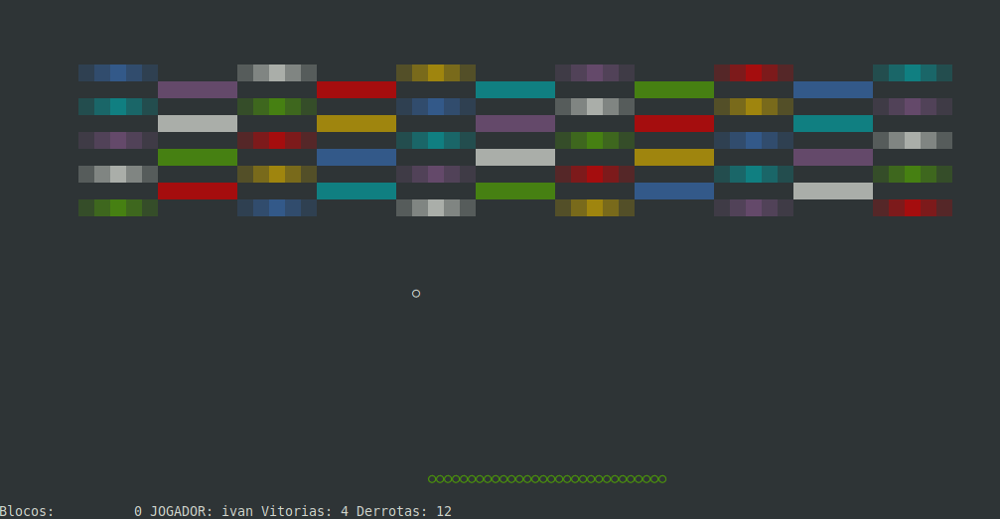

Projeto apenas para fins de noltalgia em Clipper!

(Apenas para o Brick Breacker precisa do Framework Mauaka disponível nesta conta!)

Utilizando o compilador xHarbour para Linux Ubuntu! (Tem para Windows também)

### Instalar o compilador Harbour

xHarbour compila os fontes do Clipper e já em 64bits

Download do compilador

http://www.xharbour.org/index.asp?page=download/binaries

Instale

~~~
sudo apt update
sudo apt install gcc
sudo apt install build-essential
~~~

Baixe o harbour_3.0.0-1_i386_ubu_10.04-2.deb  
~~~
sudo dpkg harbour_3.0.0-1_i386_ubu_10.04-2.deb
~~~

### Como compilar no Ubuntu

Esteja na raíz do projeto e execute os comandos abaixo

~~~
sudo harbour ./src/brickBreaker.prg  
sudo hbmk2 ./brickBreaker.c  
~~~

### Executar

~~~
./brickBreaker
~~~

